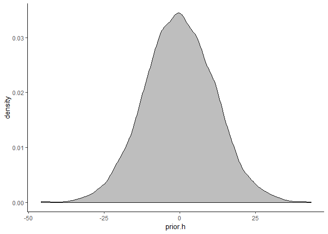
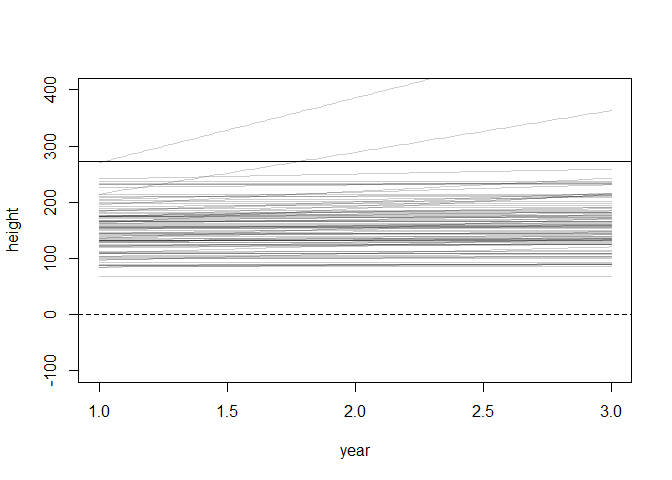
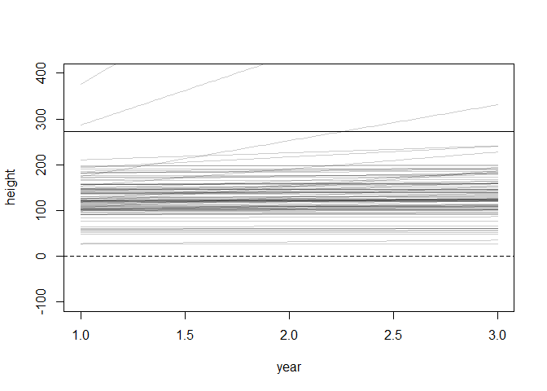
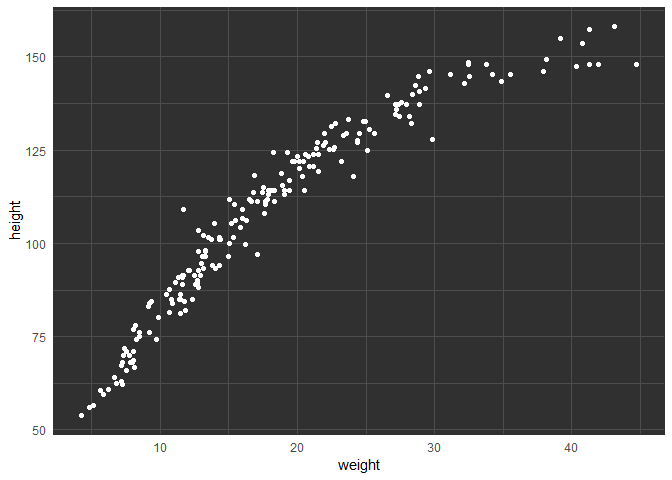
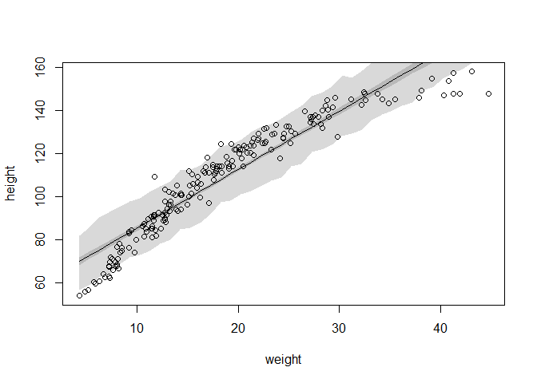

Reading: Chapter 4 through section 4.4.2  / page 98 

Problems: 4E1-4E5; 4M1, 4M2, 4M3   

### 4E1. In the model definition below, which line is the likelihood?  
> $y \sim Normal(\mu, \sigma)\Leftarrow$  
> $\mu \sim Normal(0, 10)$  
> $\sigma \sim Uniform(0, 10)$  

### 4E2. In the model definition just above, how many parameters are in the posterior distribution?
> 2  

### 4E3. Using the model definition above, write down the appropriate form of Bayes’ theorem that includes the proper likelihood and priors.  
> $$Pr(\mu, \sigma | y) = \frac{\Pi_i Normal(y_i|\mu, \sigma) Normal(\mu|0, 10) Uniform(\sigma|0, 10)}{\iint \Pi_i Normal(y_i|\mu, \sigma)Normal(\mu|0, 10) Uniform(\sigma|0, 10)~d\mu~d\sigma}$$

### 4E4. In the model definition below, which line is the linear model?  
> $y_i \sim Normal(\mu, \sigma)$  
> $\mu_i = \alpha + \beta x_i \Leftarrow$  
> $\alpha \sim Normal(0, 10)$  
> $\beta \sim Normal(0, 1)$  
> $\sigma \sim Uniform(0, 10)$  

### 4E5. In the model definition just above, how many parameters are in the posterior distribution?  
> 3

### 4M1. For the model definition below, simulate observed heights from the prior (not the posterior).  
> $y_i \sim Normal(\mu, \sigma)$   
> $\mu \sim Normal(0, 10)$   
> $\sigma \sim Uniform(0, 10)$ 


```r
sample.mu <- rnorm( 1e4 , 0 , 10 )
sample.sigma <- runif( 1e4 , 0 , 10 )
prior.h <- rnorm( 1e4 , sample.mu , sample.sigma )

# dens(prior.h)

ggplot() + aes( prior.h ) +
      geom_density( fill="gray") +
      theme_classic()
```

<!-- -->


### 4M2. Translate the model just above into a quap formula.  

```r
flist <- alist(
    height ~ dnorm( mu , sigma ) ,
    mu ~ dnorm( 0 , 10 ) ,
    sigma ~ dunif( 0 , 10 )
)
```


### 4M3. Translate the quap model formula below into a mathematical model definition.  


```r
# flist <- alist(
# y ~ dnorm( mu , sigma ),
# mu <- a + b*x,
# a ~ dnorm( 0 , 50 ),
# b ~ dunif( 0 , 10 ),
# sigma ~ dunif( 0 , 50 )
# )
```
$y_i \sim Normal(\mu_i, \sigma)$  
$\mu = \alpha + \beta x$  
$\alpha \sim Normal(0, 50)$  
$\beta \sim Normal(0, 10)$  
$\sigma \sim Uniform(0, 50)$  


### 4M4, 4M5, 4M6, 4H1, 4H2  

## 4M4. A sample of students is measured for height each year for 3 years. After the third year, you want
to fit a linear regression predicting height using year as a predictor. Write down the mathematical
model definition for this regression, using any variable names and priors you choose. Be prepared to
defend your choice of priors.
$$
h_i \sim Normal(\mu_i, \sigma) \\  
\mu_i = \alpha + \beta * year_i \\  
\alpha \sim Normal(145, 40) \\  
\beta \sim logNormal(0, 2) \\  
\sigma \sim Uniform(0, 50)  
$$
> Choosing priors depends how old the students are, but assuming growing children (age 6-12), they would be expected to have a normally distributed range of heights, with a baseline mean around 145 and a fairly wide s.d.. They could be expected to grow and not ever shrink. 


```r
N <- 1e2
a <- rnorm( N , 145 , 40 )
b <- rlnorm( N , 0 , 2 )

## R code 4.39
plot( NULL , xlim=c(1, 3) , ylim=c(-100,400) ,
    xlab="year" , ylab="height" )
abline( h=0 , lty=2 )
abline( h=272 , lty=1 , lwd=0.5 )
# mtext( "b ~ dnorm(0,10)" )

for ( i in 1:N ) curve( a[i] + b[i]* x,
    from=1 , to=3 , add=TRUE ,
    col=col.alpha("black",0.2) )
```

<!-- -->


## 4M5. Now suppose I tell you that the average height in the first year was 120 cm and that every
student got taller each year. Does this information lead you to change your choice of priors? How?
4M6. Now suppose I tell you that the variance among heights for students of the same age is never
more than 64cm. How does this lead you to revise your priors?

$$
h_i \sim Normal(\mu_i, \sigma) \\  
\mu_i = \alpha + \beta * year_i \\  
\alpha \sim Normal(120, 40) \\  
\beta \sim logNormal(0, 2) \\  
\sigma \sim Uniform(0, 50)  
$$
> Not too different...


```r
N <- 1e2
a <- rnorm( N , 120 , 40 )
b <- rlnorm( N , 0 , 2 )
xbar <- 0

## R code 4.39
plot( NULL , xlim=c(1, 3) , ylim=c(-100,400) ,
    xlab="year" , ylab="height" )
abline( h=0 , lty=2 )
abline( h=272 , lty=1 , lwd=0.5 )
# mtext( "b ~ dnorm(0,10)" )

for ( i in 1:N ) curve( a[i] + b[i]* x ,
    from=1 , to=3 , add=TRUE ,
    col=col.alpha("black",0.2) )
```

<!-- -->

4M6. Now suppose I tell you that the variance among heights for students of the same age is never
more than 64cm. How does this lead you to revise your priors?

$$
h_i \sim Normal(\mu_i, \sigma) \\  
\mu_i = \alpha + \beta * year_i \\  
\alpha \sim Normal(120, 40) \\  
\beta \sim logNormal(0, 2) \\  
\sigma \sim Uniform(0, 8)  
$$
> One small change.

# Hard.122 4. GEOCENTRIC MODELS

## 4H1. The weights listed below were recorded in the !Kung census, but heights were not recorded for
these individuals. Provide predicted heights and 89% intervals (either HPDI or PI) for each of these
individuals. That is, fill in the table below, using model-based predictions. 

|Individual| weight |expected height| 89% interval       |
|----------|--------|---------------|--------------------|
|1         | 46.95  | 156.2799      |[147.7696, 163.5432]|
|2         | 43.72  | 153.639       |[145.2185, 161.9551]|
|3         | 64.78  | 172.4450      |[164.5499, 180.3539]|
|4         | 32.59  | 143.7308      |[134.8902, 151.0331]|
|5         | 54.63  | 163.3697      |[155.1026, 170.9223]|


```r
data(Howell1)
d <- Howell1

# adult set 
d2 <- d[ d$age >= 18 , ]

#
xbar <- mean(d2$weight)

#input weights
weight.in = c(46.95, 43.72, 64.78, 32.59, 54.63)

m4.H1 <- quap(
    alist(
        height ~ dnorm( mu , sigma ) ,
        mu <- a + b * ( weight - xbar) ,
        a ~ dnorm( 178 , 20 ) ,
        b ~ dlnorm( 0 , 1 ),
        sigma ~ dunif( 0 , 50 )
    ) ,
    data=d2 )

sim.height <- sim( m4.H1 , data=list( weight=weight.in ) )
str(sim.height)
```

```
##  num [1:1000, 1:5] 156 160 159 152 152 ...
```

```r
(sim.height.mean = apply(sim.height, 2, mean))
```

```
## [1] 156.4602 153.4557 172.2356 143.1301 163.4827
```

```r
sim.height.HPDI = apply(sim.height, 2, HPDI)
t(sim.height.HPDI)
```

```
##         |0.89    0.89|
## [1,] 148.6292 164.7469
## [2,] 146.0203 161.8385
## [3,] 163.8424 180.3178
## [4,] 135.4093 151.4644
## [5,] 155.9725 172.2252
```


## 4H2. Select out all the rows in the Howell1 data with ages below 18 years of age. If you do it right,
you should end up with a new data frame with 192 rows in it.  

(a) Fit a linear regression to these data, using quap. Present and interpret the estimates. For
every 10 units of increase in weight, how much taller does the model predict a child gets?
(b) Plot the raw data, with height on the vertical axis and weight on the horizontal axis. Super-
impose the MAP regression line and 89% HPDI for the mean. Also superimpose the 89% HPDI for
predicted heights.
(c) What aspects of the model fit concern you? Describe the kinds of assumptions you would
change, if any, to improve the model. You don’t have to write any new code. Just explain what the
model appears to be doing a bad job of, and what you hypothesize would be a better model.

```r
d3 <- d[ d$age < 18 , ]
dim(d3)
```

```
## [1] 192   4
```

```r
ggplot(d3, aes( x=weight, y=height ) ) + geom_point(color="white") + 
  theme_minimal() + 
  theme(panel.background = element_rect(fill = "gray19",
                                        colour = "gray19",
                                        size = 0.5, 
                                        linetype = "solid"),
  panel.grid.major = element_line(color = "gray30"), 
  panel.grid.minor = element_line(color = "gray30"))
```

<!-- -->

```r
# a
xbar = mean(d3$weight)
m4.H2 <- quap(
    alist(
        height ~ dnorm( mu , sigma ) ,
        mu <- a + b * ( weight - xbar) ,
        a ~ dnorm( 178 , 20 ) ,
        b ~ dlnorm( 0 , 1 ),
        sigma ~ dunif( 0 , 50 )
    ) ,
    data=d3 )

precis(m4.H2)
```

```
##             mean         sd       5.5%      94.5%
## a     108.383377 0.60867070 107.410604 109.356151
## b       2.716657 0.06831733   2.607472   2.825841
## sigma   8.437404 0.43060019   7.749221   9.125586
```

```r
# b
post <- extract.samples(m4.H2)
weight.seq <- seq( from=min(d3$weight) , to=max(d3$weight))
mu <- link(m4.H2, data=data.frame( weight=weight.seq ))

mu.mean <- apply( mu , 2 , mean )
mu.HPDI <- apply( mu , 2 , HPDI , prob=0.89 )
sim.height <- sim( m4.H2 , data=list(weight=weight.seq) )
sim.HPDI <- apply( sim.height, 2, HPDI, prob=0.89 )

plot(height ~ weight, data = d3)
lines(weight.seq, mu.mean)
shade(mu.HPDI, weight.seq)
shade(sim.HPDI, weight.seq)
```

<!-- -->

> The model is not fitting the tails well, we might want to add curves through polynomials or splines. 
