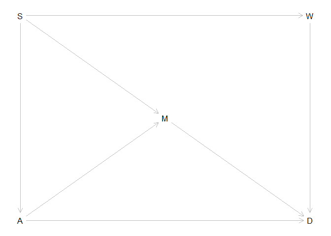
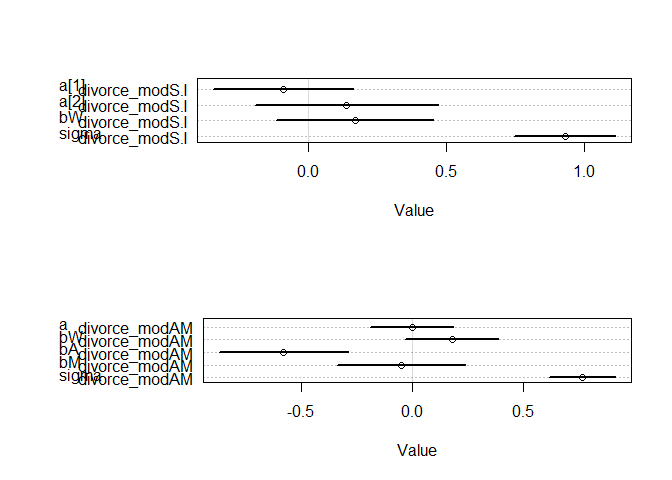
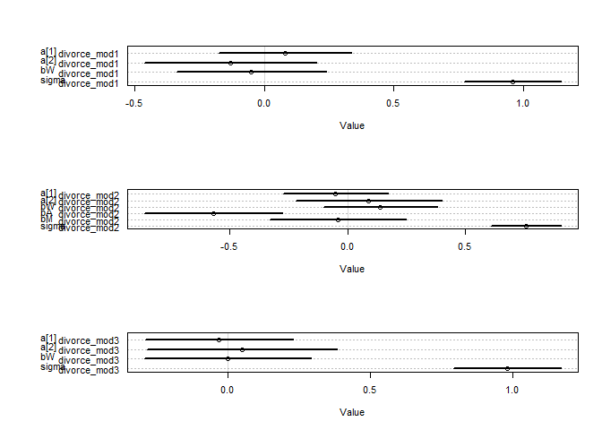
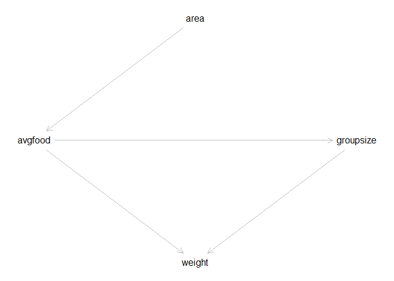
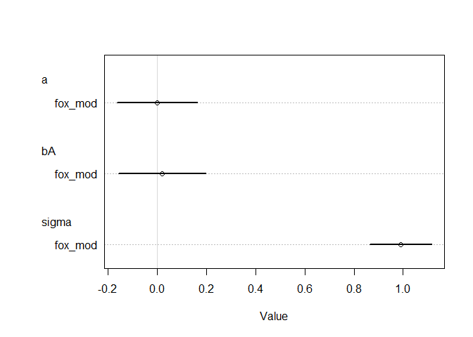
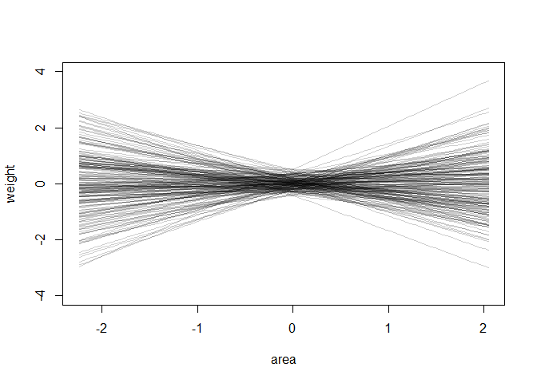
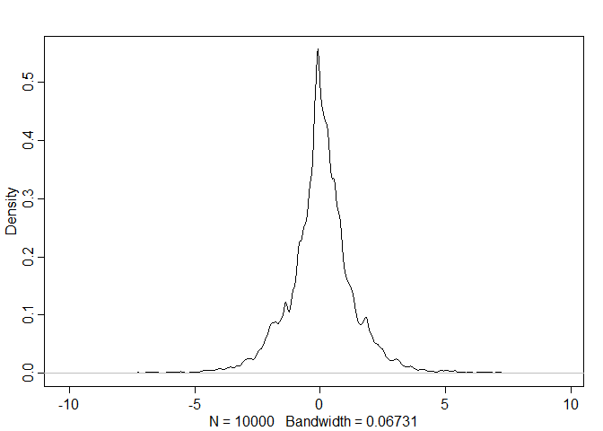
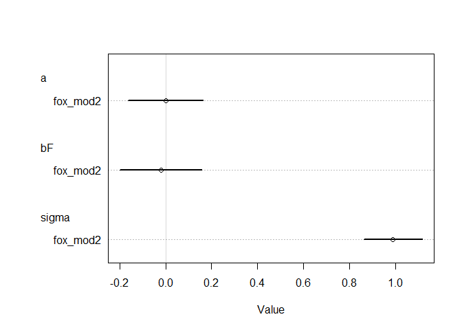
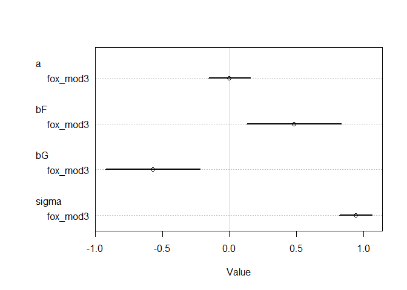

## 6H1
Use the Waffle House data, data(WaffleDivorce), to find the total causal influence of number of Waffle Houses on divorce rate. Justify your model or models with a causal graph.

```r
divorce_dag <- dagitty( "dag {
    S -> A -> D
    S -> M -> D
    S -> W -> D
    A -> M
                }")
coordinates( divorce_dag ) <- list( x=c( S=0, W=1, M=0.5, A=0, D=1 ),
                                    y=c( S=0, W=0, M=0.5, A=1, D=1 ))
plot(divorce_dag)
```

<!-- -->

```r
# Scale data into variables
d$D <- scale(d$Divorce)
d$W <- scale(d$WaffleHouses)
d$S <- d$South
d$A <- scale(d$MedianAgeMarriage)
d$M <- scale(d$Marriage)
d$s.index <- d$South +1

# Index variables: north=1 south=2

divorce_modS.I <- quap(
  alist(
    D ~ dnorm( mean=mu, sd=sigma ),
    mu <- a[s.index] + bW*W,
    a[s.index] ~ dnorm( 0 , 0.2 ) ,
    bW ~ dnorm( 0 , 0.5 ) ,
    sigma ~ dexp( 1 )
                      ) , data = d )
precis(divorce_modS.I, depth=2)
```

```
##              mean         sd        5.5%     94.5%
## a[1]  -0.08760919 0.12882663 -0.29349902 0.1182806
## a[2]   0.14145402 0.16884783 -0.12839743 0.4113055
## bW     0.17101779 0.14424688 -0.05951658 0.4015522
## sigma  0.93371282 0.09284762  0.78532439 1.0821013
```

```r
# D modeled with W, A, M
divorce_modAM <- quap(
  alist(
    D ~ dnorm( mean=mu, sd=sigma ),
    mu <- a + bW*W + bA*A + bM*M,
    a ~ dnorm( 0 , 0.2 ) ,
        c(bW, bA, bM) ~ dnorm( 0 , 0.5 ) ,
        sigma ~ dexp( 1 )
    ) , data = d )
precis(divorce_modAM)
```

```
##                mean         sd         5.5%      94.5%
## a     -3.116949e-08 0.09516344 -0.152089594  0.1520895
## bW     1.782180e-01 0.10774055  0.006027739  0.3504082
## bA    -5.843568e-01 0.14882317 -0.822204932 -0.3465086
## bM    -5.006113e-02 0.14775331 -0.286199445  0.1860772
## sigma  7.650635e-01 0.07584105  0.643854865  0.8862722
```

```r
par(mfrow=c(2,1))
plot(coeftab(divorce_modS.I))
plot(coeftab(divorce_modAM))
```

<!-- -->

```r
# Not using index variables ?!
# divorce_modS <- quap(
#   alist(
#     D ~ dnorm( mean=mu, sd=sigma ),
#     mu <- a + bW*W + bS*S,
#     a ~ dnorm( 0 , 0.2 ) ,
#     c(bW,bS) ~ dnorm( 0 , 0.5 ) ,
#     sigma ~ dexp( 1 )
#                       ) , data = d )
# precis(divorce_modS)
```

## 6H2
Build a series of models to test the implied conditional independencies of the causal graph you used in the previous problem. If any of the tests fail, how do you think the graph needs to be amended? Does the graph need more or fewer arrows? Feel free to nominate variables that aren’t in the data.

```r
impliedConditionalIndependencies(divorce_dag)
```

```
## A _||_ W | S
## D _||_ S | A, M, W
## M _||_ W | S
```

```r
# conditional independence 1 
divorce_mod1 <- quap(
  alist(
    A ~ dnorm( mean=mu, sd=sigma ),
    mu <- a[s.index] + bW*W,
    a[s.index] ~ dnorm( 0 , 0.2 ) ,
    bW ~ dnorm( 0 , 0.5 ) ,
    sigma ~ dexp( 1 )
                    ) , data = d )
precis(divorce_mod1, depth=2)
```

```
##              mean         sd       5.5%     94.5%
## a[1]   0.08054829 0.13089820 -0.1286523 0.2897489
## a[2]  -0.12835210 0.17006304 -0.4001457 0.1434415
## bW    -0.04952100 0.14755090 -0.2853358 0.1862938
## sigma  0.96058877 0.09540793  0.8081085 1.1130691
```

```r
# conditional independence 2
divorce_mod2 <- quap(
  alist(
    D ~ dnorm( mean=mu, sd=sigma ),
    mu <- a[s.index] + bA*A + bM*M + bW*W,
    a[s.index] ~ dnorm( 0 , 0.2 ) ,
        c(bW, bA, bM) ~ dnorm( 0 , 0.5 ) ,
        sigma ~ dexp( 1 )
                    ) , data = d )
precis(divorce_mod2, depth=2)
```

```
##              mean         sd        5.5%      94.5%
## a[1]  -0.04923490 0.11397529 -0.23138944  0.1329196
## a[2]   0.08727503 0.15863737 -0.16625813  0.3408082
## bW     0.13915645 0.12270967 -0.05695731  0.3352702
## bA    -0.57045799 0.14965425 -0.80963440 -0.3312816
## bM    -0.04436592 0.14730903 -0.27979420  0.1910624
## sigma  0.76088235 0.07555951  0.64012366  0.8816411
```

```r
# conditional independence 3
divorce_mod3 <- quap(
  alist(
    M ~ dnorm( mean=mu, sd=sigma ),
    mu <- a[s.index] + bW*W, 
    a[s.index] ~ dnorm( 0 , 0.2 ) ,
    bW ~ dnorm( 0 , 0.5 ),
    sigma ~ dexp( 1 )
                    ) , data = d )
precis(divorce_mod3, depth=2)
```

```
##               mean         sd       5.5%     94.5%
## a[1]  -0.029530839 0.13200871 -0.2405063 0.1814446
## a[2]   0.046661848 0.16998747 -0.2250110 0.3183347
## bW     0.003163085 0.14952895 -0.2358131 0.2421392
## sigma  0.978245745 0.09651781  0.8239916 1.1324999
```

```r
# Summary
par(mfrow=c(3,1))
plot(coeftab(divorce_mod1))
plot(coeftab(divorce_mod2))
plot(coeftab(divorce_mod3))
```

<!-- -->

## Question 1
Use a model to infer the total causal influence of area on weight. Would
increasing the area available to each fox make it heavier (healthier)? You
might want to standardize the variables. Regardless, use prior predictive
simulation to show that your model’s prior predictions stay within the pos-
sible outcome range.

```r
fox_dag <- dagitty( "dag{
                    area -> avgfood -> weight
                    avgfood -> groupsize -> weight
                    }")
coordinates( fox_dag ) <- list( x=c(area=0.5, avgfood=0, groupsize=1, weight=0.5),
                                  y=c(area=0, avgfood=0.5, groupsize=0.5, weight=1) )

plot(fox_dag)
```

<!-- -->

```r
adjustmentSets( fox_dag, exposure="area", outcome="weight" )
```

```
##  {}
```
There are no back-door paths from area to weight.


```r
data(foxes)
f <- foxes
f$W <- standardize(f$weight)
f$A <- standardize(f$area)

fox_mod <- quap(
  alist(
    W ~ dnorm( mean=mu, sd=sigma ),
    mu <- a + bA*A,
    a ~ dnorm( 0 , 0.2 ) ,
        bA ~ dnorm( 0 , 0.5 ) ,
        sigma ~ dexp( 1 )
    ) , data = f )
precis(fox_mod)
```

```
##                mean         sd       5.5%     94.5%
## a     -2.197346e-08 0.08360872 -0.1336229 0.1336229
## bA     1.883386e-02 0.09089588 -0.1264353 0.1641030
## sigma  9.912667e-01 0.06466659  0.8879170 1.0946164
```

```r
plot(coeftab(fox_mod))
```

<!-- -->

```r
# plot prior parameters
par(mfrow=c(3,1))
curve( dnorm( x, 0 , 0.2 ), from=-1, to=1, ylab="prior for a" )
curve( dnorm( x, 0 , 0.5 ), from=-2, to=2, ylab="prior for bA" )
curve( dexp( x, 1), from=-0.01, to=5, ylab="prior for sigma" )
```

<!-- -->

```r
# prior predictive simulation
N <- 200
sim.a <- rnorm( N, 0, 0.2 ) 
sim.bA <- rnorm( N, 0, 0.5 )
sim.A <- seq( from=min(f$A) , to=max(f$A), length.out = N )
sim.mu <- sim.a + sim.bA * sim.A
sim.sigma <- rexp(N, 1) 
prior.W <- rnorm(1e4, sim.mu, sim.sigma)

par(mfrow=c(1,1))
plot( NULL , xlim=range(f$A) , ylim=c(-4,4) , xlab="area" , ylab="weight" )
for ( i in 1:N ) curve( sim.a[i] + sim.bA[i]*x ,
  from=min(f$A) , to=max(f$A) , add=TRUE ,
  col=col.alpha("black",0.2) )
```

<!-- -->

```r
dens( prior.W)
```

<!-- -->

## Question 2

```r
f$F <- standardize(f$avgfood)

fox_mod2 <- quap(
  alist(
    W ~ dnorm( mean=mu, sd=sigma ),
    mu <- a + bF*F,
    a ~ dnorm( 0 , 0.2 ) ,
        bF ~ dnorm( 0 , 0.5 ) ,
        sigma ~ dexp( 1 )
    ) , data = f )
precis(fox_mod2)
```

```
##                mean         sd       5.5%     94.5%
## a     -2.159763e-07 0.08359998 -0.1336091 0.1336087
## bF    -2.420646e-02 0.09088478 -0.1694579 0.1210450
## sigma  9.911413e-01 0.06465814  0.8878051 1.0944775
```

```r
plot(coeftab(fox_mod2))
```

<!-- -->

## Question 3

```r
f$G <-  standardize(f$groupsize)
fox_mod3 <- quap(
  alist(
    W ~ dnorm( mean=mu, sd=sigma ),
    mu <- a + bF*F + bG*G,
    a ~ dnorm( 0 , 0.2 ) ,
        c( bF, bG ) ~ dnorm( 0 , 0.5 ) ,
        sigma ~ dexp( 1 )
    ) , data = f )
precis(fox_mod3)
```

```
##                mean         sd       5.5%      94.5%
## a     -1.036217e-05 0.08013484 -0.1280813  0.1280606
## bF     4.774083e-01 0.17911525  0.1911475  0.7636691
## bG    -5.737808e-01 0.17913254 -0.8600692 -0.2874924
## sigma  9.419987e-01 0.06174513  0.8433180  1.0406793
```

```r
plot(coeftab(fox_mod3))
```

<!-- -->

