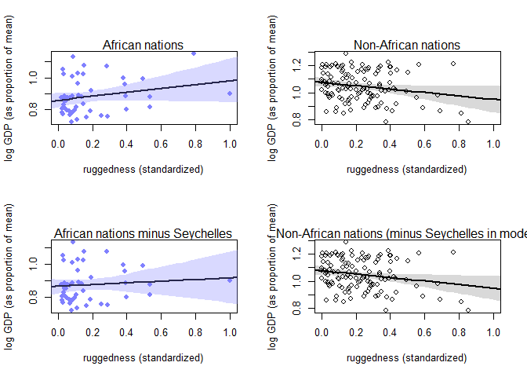

##8E1. For each of the causal relationships below, name a hypothetical third variable that would lead to an interaction effect.  
(1) Bread dough rises because of yeast.  
> * temperature, [sugar]   

(2) Education leads to higher income.   
> * family
* local environment (i.e., opportunities e.g. city vs. rural)  
* nutrition  
* choice of major  

(3) Gasoline makes a car go.  
> * spark plugs  

##8M3. In parts of North America, ravens depend upon wolves for their food. This is because ravens
are carnivorous but cannot usually kill or open carcasses of prey. Wolves however can and do kill
and tear open animals, and they tolerate ravens co-feeding at their kills. This species relationship
is generally described as a “species interaction.” Can you invent a hypothetical set of data on raven
population size in which this relationship would manifest as a statistical interaction? Do you think
the biological interaction could be linear? Why or why not?  


```r
# Number of samples
N <- 1000

# Prey
prey <- rnorm(N, mean=0, sd=1)

# Wolf
m.wolf <- 0.5*prey
wolf <- rnorm( N, mean=m.wolf, sd=1 )

# Raven
m.raven <- 0.1*prey + 0.3*wolf*prey 
raven <- rnorm( N, mean=m.raven, sd=1 )

# Make data frame
df.raven <- data.frame(raven, prey, wolf)
```


```r
# Raven-wolf-prey model
m8M3 <- quap(
  alist(
    raven ~ dnorm( mu, sigma ),
    mu <- a + bP*prey + bW*wolf + bPW*prey*wolf,
    a ~ dnorm( 0, 1 ),
    c( bP, bW, bPW ) ~ dnorm( 0, 1 ),
    sigma ~ dunif( 0, 3 )
  ),
  data = df.raven)

precis(m8M3)
```

```
##               mean         sd        5.5%      94.5%
## a     -0.009887152 0.03318822 -0.06292834 0.04315403
## bP     0.072120951 0.03537490  0.01558503 0.12865688
## bW    -0.012081991 0.03087561 -0.06142718 0.03726320
## bPW    0.270996563 0.02515872  0.23078807 0.31120505
## sigma  0.978959267 0.02189012  0.94397462 1.01394391
```


##8H3. Consider again the data(rugged) data on economic development and terrain ruggedness,
examined in this chapter. One of the African countries in that example, Seychelles, is far outside
the cloud of other nations, being a rare country with both relatively high GDP and high ruggedness.
Seychelles is also unusual, in that it is a group of islands far from the coast of mainland Africa, and
its main economic activity is tourism.  

One might suspect that this one nation is exerting a strong influence on the conclusions. In
this problem, I want you to drop Seychelles from the data and re-evaluate the hypothesis that the
relationship of African economies with ruggedness is different from that on other continents.  

(a) Begin by using map to fit just the interaction model:  
$y_i \sim Normal(\mu_i, \sigma)$    
$\mu_i = \alpha + \beta_A A_i + \beta_R R_i + \beta_{AR} A_i R_i$

where y is log GDP per capita in the year 2000 (log of rgdppc_2000); A is cont_africa, the dummy
variable for being an African nation; and R is the variable rugged. Choose your own priors. Compare
the inference from this model fit to the data without Seychelles to the same model fit to the full data. Does it still seem like the effect of ruggedness depends upon continent? How much has the expected relationship changed? 


```r
## R code 8.1
data(rugged)
d <- rugged

# make log version of outcome
d$log_gdp <- log( d$rgdppc_2000 )

# extract countries with GDP data
dd <- d[ complete.cases(d$rgdppc_2000) , ]

# rescale variables
dd$log_gdp_std <- dd$log_gdp / mean(dd$log_gdp)
dd$rugged_std <- dd$rugged / max(dd$rugged)

# split countries into Africa and not-Africa
d.A1 <- dd[ dd$cont_africa==1 , ] # Africa
d.A0 <- dd[ dd$cont_africa==0 , ] # not Africa

########################
  # Sí Sey ------------#
m8H3 <- quap(
    alist(
        log_gdp_std ~ dnorm( mu , sigma ) ,
        mu <- a + bA*cont_africa +  bR*rugged_std + bAR*cont_africa*rugged_std ,
        a ~ dnorm( 1 , 0.1 ) ,
        c(bA, bR, bAR) ~ dnorm( 0 , 0.3 ) ,
        sigma ~ dexp( 1 )
    ) ,
    data=dd )
precis(m8H3, depth=2)
```

```
##             mean          sd       5.5%       94.5%
## a      1.0773419 0.015679954  1.0522823  1.10240150
## bA    -0.2192409 0.025490596 -0.2599798 -0.17850202
## bR    -0.1278808 0.053520434 -0.2134168 -0.04234482
## bAR    0.2482181 0.089579455  0.1050529  0.39138341
## sigma  0.1095336 0.005941214  0.1000383  0.11902876
```

```r
  # No Sey ------------#
dd.noSey <- dd %>% subset( country!="Seychelles" )
# dd.noSey <- dd[ dd$country!="Seychelles", ]

m8H3.noSey <- quap(
    alist(
        log_gdp_std ~ dnorm( mu , sigma ) ,
        mu <- a + bA*cont_africa +  bR*rugged_std + bAR*cont_africa*rugged_std ,
        a ~ dnorm( 1 , 0.1 ) ,
        c(bA, bR, bAR) ~ dnorm( 0 , 0.3 ) ,
        sigma ~ dexp( 1 )
    ) ,
    data=dd.noSey )
precis(m8H3.noSey, depth=2)
```

```
##             mean          sd        5.5%       94.5%
## a      1.0778520 0.015564651  1.05297671  1.10272735
## bA    -0.2125448 0.025517981 -0.25332746 -0.17176214
## bR    -0.1300190 0.053135052 -0.21493908 -0.04509893
## bAR    0.1819443 0.094783043  0.03046266  0.33342587
## sigma  0.1086703 0.005911209  0.09922309  0.11811760
```
> There is less of an interaction effect, indicated by the slope bAR going from 0.25 to 0.18.  

(b) Now plot the predictions of the interaction model, with and without Seychelles. Does it still
seem like the effect of ruggedness depends upon continent? How much has the expected relationship
changed?  


```r
par(mfrow = c(2, 2))
####------ With Seychelles -------###
d.A1.noSey <- subset(d.A1, country!="Seychelles")

## R code 8.17
# plot Africa - cont_africa=1
plot( d.A1$rugged_std , d.A1$log_gdp_std , pch=16 , col=rangi2 ,
    xlab="ruggedness (standardized)" , ylab="log GDP (as proportion of mean)" ,
    xlim=c(0,1) )

rugged_seq <- seq( from=-0.1 , to=1.1 , length.out=30 )
mu <- link( m8H3 , data=data.frame( cont_africa=1 , rugged_std=rugged_seq ) )
mu_mean <- apply( mu , 2 , mean )
mu_ci <- apply( mu , 2 , PI , prob=0.97 )

lines( rugged_seq , mu_mean , lwd=2 )
shade( mu_ci , rugged_seq , col=col.alpha(rangi2,0.3) )
mtext("African nations")

# plot non-Africa - cont_africa=0
plot( d.A0$rugged_std , d.A0$log_gdp_std , pch=1 , col="black" ,
    xlab="ruggedness (standardized)" , ylab="log GDP (as proportion of mean)" ,
    xlim=c(0,1) )
mu <- link( m8H3 , data=data.frame( cont_africa=0 , rugged_std=rugged_seq ) )
mu_mean <- apply( mu , 2 , mean )
mu_ci <- apply( mu , 2 , PI , prob=0.97 )
lines( rugged_seq , mu_mean , lwd=2 )
shade( mu_ci , rugged_seq )
mtext("Non-African nations")


###--------- Without Seychelles ------###
d.A1.noSey <- subset( d.A1, country!="Seychelles" )

## R code 8.17
# plot Africa - cont_africa=1
plot( d.A1.noSey$rugged_std , d.A1.noSey$log_gdp_std , pch=16 , col=rangi2 ,
    xlab="ruggedness (standardized)" , ylab="log GDP (as proportion of mean)" ,
    xlim=c(0,1) )

rugged.seq <- seq( from=-0.1 , to=1.1 , length.out=30 )
mu <- link( m8H3.noSey , data=data.frame( cont_africa=1 , rugged_std=rugged_seq ) )
mu_mean <- apply( mu , 2 , mean )
mu_ci <- apply( mu , 2 , PI , prob=0.97 )

lines( rugged_seq , mu_mean , lwd=2 )
shade( mu_ci , rugged_seq , col=col.alpha(rangi2,0.3) )
mtext("African nations minus Seychelles")

# plot non-Africa - cont_africa=0
plot( d.A0$rugged_std , d.A0$log_gdp_std , pch=1 , col="black" ,
    xlab="ruggedness (standardized)" , ylab="log GDP (as proportion of mean)" ,
    xlim=c(0,1) )
mu <- link( m8H3.noSey , data=data.frame( cont_africa=0 , rugged_std=rugged_seq ) )
mu_mean <- apply( mu , 2 , mean )
mu_ci <- apply( mu , 2 , PI , prob=0.97 )
lines( rugged_seq , mu_mean , lwd=2 )
shade( mu_ci , rugged_seq )
mtext("Non-African nations (minus Seychelles in model)")
```

<!-- -->

> The slope for African nations' gdp v. ruggedness has decreased.  


(c) Finally, conduct a model comparison analysis, using WAIC. Fit three models to the data without Seychelles:  
Model 1 : $y_i \sim Normal(\mu_i, \sigma)$  
$\mu_i = \alpha + \beta_R R_i$  
Model 2 : $y_i \sim Normal(\mu_i, \sigma)$  
$\mu_i = \alpha + \beta_A A_i + \beta_R R_i$  
Model 3 : $y_i \sim Normal(\mu_i, \sigma)$  
$\mu_i = \alpha + \beta_A A_i + \beta_R R_i + \beta_{AR} A_i R_i$  
Use whatever priors you think are sensible. Plot the model-averaged predictions of this model set.
Do your inferences differ from those in (b)? Why or why not?

```r
m8H3.C1 <- quap(
    alist(
        log_gdp_std ~ dnorm( mu , sigma ) ,
        mu <- a + bR*rugged_std,
        a ~ dnorm( 1 , 0.1 ) ,
        bR ~ dnorm( 0, 0.3 ) ,
        sigma ~ dexp( 1 )
    ) ,
    data=dd.noSey )

m8H3.C2 <- quap(
    alist(
        log_gdp_std ~ dnorm( mu , sigma ) ,
        mu <- a + bA*cont_africa +  bR*rugged_std,
        a ~ dnorm( 1 , 0.1 ) ,
        c(bA, bR) ~ dnorm( 0 , 0.3 ) ,
        sigma ~ dexp( 1 )
    ) ,
    data=dd.noSey )

m8H3.C3 <- quap(
    alist(
        log_gdp_std ~ dnorm( mu , sigma ) ,
        mu <- a + bA*cont_africa +  bR*rugged_std + bAR*cont_africa*rugged_std ,
        a ~ dnorm( 1 , 0.1 ) ,
        c(bA, bR, bAR) ~ dnorm( 0 , 0.3 ) ,
        sigma ~ dexp( 1 )
    ) ,
    data=dd.noSey )

compare(m8H3.C1, m8H3.C2, m8H3.C3)
```

```
##              WAIC    pWAIC     dWAIC       weight       SE       dSE
## m8H3.C3 -261.2951 4.304058  0.000000 8.449888e-01 15.01467        NA
## m8H3.C2 -257.9034 3.970196  3.391652 1.550112e-01 14.37504  3.242137
## m8H3.C1 -187.9928 2.607840 73.302300 1.022019e-16 13.36167 15.472823
```
> The model with A and R is equivalent to the interaction model.


##Plus, use the tomato.csv (attached) data set and evaluate whether hypocotyl length ("hyp") is affected by shade ("trt"), species ("species") and their interaction.

```r
tomato <- read.csv("Tomato.csv")
head(tomato)
```

```
##   shelf flat col row    acs trt days   date   hyp int1 int2 int3 int4
## 1     Z    1   B   1 LA2580   H   28 5/5/08 19.46 2.37 1.59 1.87 0.51
## 2     Z    1   C   1 LA1305   H   28 5/5/08 31.28 3.34 0.01 9.19 1.62
## 3     Z    1   D   1 LA1973   H   28 5/5/08 56.65 8.43 2.39 6.70 3.69
## 4     Z    1   E   1 LA2748   H   28 5/5/08 35.18 0.56 0.00 1.60 0.61
## 5     Z    1   F   1 LA2931   H   28 5/5/08 35.32 0.82 0.02 1.49 0.46
## 6     Z    1   G   1 LA1317   H   28 5/5/08 28.74 1.07 6.69 5.72 4.76
##   intleng totleng petleng leafleng leafwid leafnum ndvi      lat      lon
## 1    6.34   25.80   15.78    30.53   34.44       5  111  -9.5167 -78.0083
## 2   14.16   45.44   12.36    22.93   13.99       4  120 -13.3833 -75.3583
## 3   21.21   77.86   13.05    46.71   43.78       5  110 -16.2333 -71.7000
## 4    2.77   37.95    8.08    26.82   33.28       5  105 -20.4833 -69.9833
## 5    2.79   38.11    7.68    22.40   23.61       5  106 -20.9167 -69.0667
## 6   18.24   46.98   23.66    42.35   42.35       5  132 -13.4167 -73.8417
##    alt         species who
## 1  740    S. pennellii Dan
## 2 3360   S. peruvianum Dan
## 3 2585   S. peruvianum Dan
## 4 1020     S. chilense Dan
## 5 2460     S. chilense Dan
## 6 2000 S. chmielewskii Dan
```

```r
str(tomato)
```

```
## 'data.frame':	1008 obs. of  25 variables:
##  $ shelf   : Factor w/ 6 levels "U","V","W","X",..: 6 6 6 6 6 6 6 6 6 6 ...
##  $ flat    : int  1 1 1 1 1 1 1 1 1 1 ...
##  $ col     : Factor w/ 9 levels "A","B","C","D",..: 2 3 4 5 6 7 9 2 3 4 ...
##  $ row     : int  1 1 1 1 1 1 1 2 2 2 ...
##  $ acs     : Factor w/ 36 levels "LA1028","LA1305",..: 23 2 19 26 30 5 14 32 7 34 ...
##  $ trt     : Factor w/ 2 levels "H","L": 1 1 1 1 1 1 1 1 1 1 ...
##  $ days    : int  28 28 28 28 28 28 28 28 28 28 ...
##  $ date    : Factor w/ 2 levels "5/5/08","5/6/08": 1 1 1 1 1 1 1 1 1 1 ...
##  $ hyp     : num  19.5 31.3 56.6 35.2 35.3 ...
##  $ int1    : num  2.37 3.34 8.43 0.56 0.82 1.07 2.85 2.08 5.43 4.08 ...
##  $ int2    : num  1.59 0.01 2.39 0 0.02 6.69 0.41 0.53 0.81 3.26 ...
##  $ int3    : num  1.87 9.19 6.7 1.6 1.49 5.72 3.79 1.9 3.63 3.49 ...
##  $ int4    : num  0.51 1.62 3.69 0.61 0.46 4.76 3.25 NA 2.66 3.02 ...
##  $ intleng : num  6.34 14.16 21.21 2.77 2.79 ...
##  $ totleng : num  25.8 45.4 77.9 38 38.1 ...
##  $ petleng : num  15.78 12.36 13.05 8.08 7.68 ...
##  $ leafleng: num  30.5 22.9 46.7 26.8 22.4 ...
##  $ leafwid : num  34.4 14 43.8 33.3 23.6 ...
##  $ leafnum : int  5 4 5 5 5 5 5 4 5 5 ...
##  $ ndvi    : int  111 120 110 105 106 132 118 112 107 123 ...
##  $ lat     : num  -9.52 -13.38 -16.23 -20.48 -20.92 ...
##  $ lon     : num  -78 -75.4 -71.7 -70 -69.1 ...
##  $ alt     : int  740 3360 2585 1020 2460 2000 2920 480 75 3540 ...
##  $ species : Factor w/ 5 levels "S. chilense",..: 4 5 5 1 1 2 3 4 5 5 ...
##  $ who     : Factor w/ 2 levels "Dan","Pepe": 1 1 1 1 1 1 1 1 1 1 ...
```

```r
tomato$h <- standardize(tomato$hyp)

tomato$s <- tomato$species %>% as.numeric()
tomato$t <- tomato$trt %>% as.numeric() - 1

tomato <- tomato %>% cbind( model.matrix(~s, data=tomato) )
```


```r
# mtomato <- quap(
#     alist(
#         h ~ dnorm( mu , sigma ) ,
#         mu <- a + bShade*t +  bSpecies*species + bSS*t*s ,
#         a ~ dnorm( 0 , 1 ) ,
#         c(bShade,bSpecies,bSS) ~ dnorm( 0 , 1 ) ,
#         sigma ~ dexp( 1 )
#     ) ,
#     data=tomato )
# precis(mtomato, depth=2)
```
