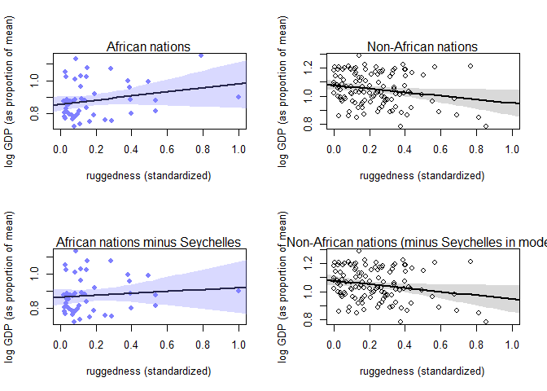
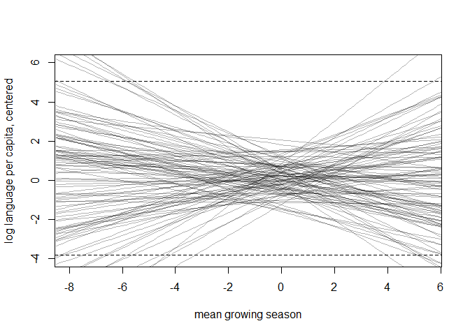

##8E1. For each of the causal relationships below, name a hypothetical third variable that would lead to an interaction effect.  
(1) Bread dough rises because of yeast.  
> * temperature, [sugar]   

(2) Education leads to higher income.   
> * family
* local environment (i.e., opportunities e.g. city vs. rural)  
* nutrition  
* choice of major  

(3) Gasoline makes a car go.  
> * spark plugs  

##8M3. In parts of North America, ravens depend upon wolves for their food. This is because ravens
are carnivorous but cannot usually kill or open carcasses of prey. Wolves however can and do kill
and tear open animals, and they tolerate ravens co-feeding at their kills. This species relationship
is generally described as a “species interaction.” Can you invent a hypothetical set of data on raven
population size in which this relationship would manifest as a statistical interaction? Do you think
the biological interaction could be linear? Why or why not?  


```r
# Number of samples
N <- 1000

# Prey
prey <- rnorm(N, mean=0, sd=1)

# Wolf
m.wolf <- 0.5*prey
wolf <- rnorm( N, mean=m.wolf, sd=1 )

# Raven
m.raven <- 0.1*prey + 0.3*wolf*prey 
raven <- rnorm( N, mean=m.raven, sd=1 )

# Make data frame
df.raven <- data.frame(raven, prey, wolf)
```


```r
# Raven-wolf-prey model
m8M3 <- quap(
  alist(
    raven ~ dnorm( mu, sigma ),
    mu <- a + bP*prey + bW*wolf + bPW*prey*wolf,
    a ~ dnorm( 0, 1 ),
    c( bP, bW, bPW ) ~ dnorm( 0, 1 ),
    sigma ~ dunif( 0, 3 )
  ),
  data = df.raven)

precis(m8M3)
```

```
##              mean         sd        5.5%      94.5%
## a     -0.01090604 0.03392000 -0.06511676 0.04330467
## bP     0.13928200 0.03508155  0.08321491 0.19534909
## bW    -0.02342670 0.03099851 -0.07296830 0.02611491
## bPW    0.29029833 0.02612505  0.24854545 0.33205121
## sigma  0.98810339 0.02209405  0.95279283 1.02341395
```


##8H3. Consider again the data(rugged) data on economic development and terrain ruggedness,
examined in this chapter. One of the African countries in that example, Seychelles, is far outside
the cloud of other nations, being a rare country with both relatively high GDP and high ruggedness.
Seychelles is also unusual, in that it is a group of islands far from the coast of mainland Africa, and
its main economic activity is tourism.  

One might suspect that this one nation is exerting a strong influence on the conclusions. In
this problem, I want you to drop Seychelles from the data and re-evaluate the hypothesis that the
relationship of African economies with ruggedness is different from that on other continents.  

(a) Begin by using map to fit just the interaction model:  
$y_i \sim Normal(\mu_i, \sigma)$    
$\mu_i = \alpha + \beta_A A_i + \beta_R R_i + \beta_{AR} A_i R_i$

where y is log GDP per capita in the year 2000 (log of rgdppc_2000); A is cont_africa, the dummy
variable for being an African nation; and R is the variable rugged. Choose your own priors. Compare
the inference from this model fit to the data without Seychelles to the same model fit to the full data. Does it still seem like the effect of ruggedness depends upon continent? How much has the expected relationship changed? 


```r
## R code 8.1
data(rugged)
d <- rugged

# make log version of outcome
d$log_gdp <- log( d$rgdppc_2000 )

# extract countries with GDP data
dd <- d[ complete.cases(d$rgdppc_2000) , ]

# rescale variables
dd$log_gdp_std <- dd$log_gdp / mean(dd$log_gdp)
dd$rugged_std <- dd$rugged / max(dd$rugged)

# split countries into Africa and not-Africa
d.A1 <- dd[ dd$cont_africa==1 , ] # Africa
d.A0 <- dd[ dd$cont_africa==0 , ] # not Africa

########################
  # Sí Sey ------------#
m8H3 <- quap(
    alist(
        log_gdp_std ~ dnorm( mu , sigma ) ,
        mu <- a + bA*cont_africa +  bR*rugged_std + bAR*cont_africa*rugged_std ,
        a ~ dnorm( 1 , 0.1 ) ,
        c(bA, bR, bAR) ~ dnorm( 0 , 0.3 ) ,
        sigma ~ dexp( 1 )
    ) ,
    data=dd )
precis(m8H3, depth=2)
```

```
##             mean          sd       5.5%       94.5%
## a      1.0773749 0.015680303  1.0523147  1.10243504
## bA    -0.2193276 0.025491029 -0.2600672 -0.17858800
## bR    -0.1279723 0.053521679 -0.2135103 -0.04243431
## bAR    0.2484380 0.089581107  0.1052701  0.39160592
## sigma  0.1095370 0.005941668  0.1000411  0.11903292
```

```r
  # No Sey ------------#
dd.noSey <- dd %>% subset( country!="Seychelles" )
# dd.noSey <- dd[ dd$country!="Seychelles", ]

m8H3.noSey <- quap(
    alist(
        log_gdp_std ~ dnorm( mu , sigma ) ,
        mu <- a + bA*cont_africa +  bR*rugged_std + bAR*cont_africa*rugged_std ,
        a ~ dnorm( 1 , 0.1 ) ,
        c(bA, bR, bAR) ~ dnorm( 0 , 0.3 ) ,
        sigma ~ dexp( 1 )
    ) ,
    data=dd.noSey )
precis(m8H3.noSey, depth=2)
```

```
##             mean          sd        5.5%       94.5%
## a      1.0778588 0.015564013  1.05298454  1.10273314
## bA    -0.2125532 0.025516951 -0.25333422 -0.17177219
## bR    -0.1300486 0.053132880 -0.21496517 -0.04513197
## bAR    0.1819988 0.094779319  0.03052316  0.33347448
## sigma  0.1086658 0.005910583  0.09921950  0.11811201
```
> There is less of an interaction effect, indicated by the slope bAR going from 0.25 to 0.18.  

(b) Now plot the predictions of the interaction model, with and without Seychelles. Does it still
seem like the effect of ruggedness depends upon continent? How much has the expected relationship
changed?  


```r
par(mfrow = c(2, 2))
####------ With Seychelles -------###
d.A1.noSey <- subset(d.A1, country!="Seychelles")

## R code 8.17
# plot Africa - cont_africa=1
plot( d.A1$rugged_std , d.A1$log_gdp_std , pch=16 , col=rangi2 ,
    xlab="ruggedness (standardized)" , ylab="log GDP (as proportion of mean)" ,
    xlim=c(0,1) )

rugged_seq <- seq( from=-0.1 , to=1.1 , length.out=30 )
mu <- link( m8H3 , data=data.frame( cont_africa=1 , rugged_std=rugged_seq ) )
mu_mean <- apply( mu , 2 , mean )
mu_ci <- apply( mu , 2 , PI , prob=0.97 )

lines( rugged_seq , mu_mean , lwd=2 )
shade( mu_ci , rugged_seq , col=col.alpha(rangi2,0.3) )
mtext("African nations")

# plot non-Africa - cont_africa=0
plot( d.A0$rugged_std , d.A0$log_gdp_std , pch=1 , col="black" ,
    xlab="ruggedness (standardized)" , ylab="log GDP (as proportion of mean)" ,
    xlim=c(0,1) )
mu <- link( m8H3 , data=data.frame( cont_africa=0 , rugged_std=rugged_seq ) )
mu_mean <- apply( mu , 2 , mean )
mu_ci <- apply( mu , 2 , PI , prob=0.97 )
lines( rugged_seq , mu_mean , lwd=2 )
shade( mu_ci , rugged_seq )
mtext("Non-African nations")


###--------- Without Seychelles ------###
d.A1.noSey <- subset( d.A1, country!="Seychelles" )

## R code 8.17
# plot Africa - cont_africa=1
plot( d.A1.noSey$rugged_std , d.A1.noSey$log_gdp_std , pch=16 , col=rangi2 ,
    xlab="ruggedness (standardized)" , ylab="log GDP (as proportion of mean)" ,
    xlim=c(0,1) )

rugged.seq <- seq( from=-0.1 , to=1.1 , length.out=30 )
mu <- link( m8H3.noSey , data=data.frame( cont_africa=1 , rugged_std=rugged_seq ) )
mu_mean <- apply( mu , 2 , mean )
mu_ci <- apply( mu , 2 , PI , prob=0.97 )

lines( rugged_seq , mu_mean , lwd=2 )
shade( mu_ci , rugged_seq , col=col.alpha(rangi2,0.3) )
mtext("African nations minus Seychelles")

# plot non-Africa - cont_africa=0
plot( d.A0$rugged_std , d.A0$log_gdp_std , pch=1 , col="black" ,
    xlab="ruggedness (standardized)" , ylab="log GDP (as proportion of mean)" ,
    xlim=c(0,1) )
mu <- link( m8H3.noSey , data=data.frame( cont_africa=0 , rugged_std=rugged_seq ) )
mu_mean <- apply( mu , 2 , mean )
mu_ci <- apply( mu , 2 , PI , prob=0.97 )
lines( rugged_seq , mu_mean , lwd=2 )
shade( mu_ci , rugged_seq )
mtext("Non-African nations (minus Seychelles in model)")
```

<!-- -->

> The slope for African nations' gdp v. ruggedness has decreased.  


(c) Finally, conduct a model comparison analysis, using WAIC. Fit three models to the data without Seychelles:  
Model 1 : $y_i \sim Normal(\mu_i, \sigma)$  
$\mu_i = \alpha + \beta_R R_i$  
Model 2 : $y_i \sim Normal(\mu_i, \sigma)$  
$\mu_i = \alpha + \beta_A A_i + \beta_R R_i$  
Model 3 : $y_i \sim Normal(\mu_i, \sigma)$  
$\mu_i = \alpha + \beta_A A_i + \beta_R R_i + \beta_{AR} A_i R_i$  
Use whatever priors you think are sensible. Plot the model-averaged predictions of this model set.
Do your inferences differ from those in (b)? Why or why not?

```r
m8H3.C1 <- quap(
    alist(
        log_gdp_std ~ dnorm( mu , sigma ) ,
        mu <- a + bR*rugged_std,
        a ~ dnorm( 1 , 0.1 ) ,
        bR ~ dnorm( 0, 0.3 ) ,
        sigma ~ dexp( 1 )
    ) ,
    data=dd.noSey )

m8H3.C2 <- quap(
    alist(
        log_gdp_std ~ dnorm( mu , sigma ) ,
        mu <- a + bA*cont_africa +  bR*rugged_std,
        a ~ dnorm( 1 , 0.1 ) ,
        c(bA, bR) ~ dnorm( 0 , 0.3 ) ,
        sigma ~ dexp( 1 )
    ) ,
    data=dd.noSey )

m8H3.C3 <- quap(
    alist(
        log_gdp_std ~ dnorm( mu , sigma ) ,
        mu <- a + bA*cont_africa +  bR*rugged_std + bAR*cont_africa*rugged_std ,
        a ~ dnorm( 1 , 0.1 ) ,
        c(bA, bR, bAR) ~ dnorm( 0 , 0.3 ) ,
        sigma ~ dexp( 1 )
    ) ,
    data=dd.noSey )

compare(m8H3.C1, m8H3.C2, m8H3.C3)
```

```
##              WAIC    pWAIC     dWAIC       weight       SE       dSE
## m8H3.C3 -260.6967 4.587143  0.000000 7.934161e-01 15.15010        NA
## m8H3.C2 -258.0055 3.891181  2.691283 2.065839e-01 14.35791  3.256195
## m8H3.C1 -188.3866 2.446231 72.310136 1.575993e-16 13.26320 15.541374
```
> The model with A and R is equivalent to the interaction model.


##Plus, use the tomato.csv (attached) data set and evaluate whether hypocotyl length ("hyp") is affected by shade ("trt"), species ("species") and their interaction.

```r
tomato <- read.csv("Tomato.csv")
tomato <- subset(tomato, select = c(hyp, trt, species))

tomato$h <- tomato$hyp / max(tomato$hyp)
tomato$s <- tomato$species %>% as.numeric()
tomato$t <- tomato$trt %>% as.numeric() - 1

head(tomato)
```

```
##     hyp trt         species         h s t
## 1 19.46   H    S. pennellii 0.2608579 4 0
## 2 31.28   H   S. peruvianum 0.4193029 5 0
## 3 56.65   H   S. peruvianum 0.7593834 5 0
## 4 35.18   H     S. chilense 0.4715818 1 0
## 5 35.32   H     S. chilense 0.4734584 1 0
## 6 28.74   H S. chmielewskii 0.3852547 2 0
```

```r
str(tomato)
```

```
## 'data.frame':	1008 obs. of  6 variables:
##  $ hyp    : num  19.5 31.3 56.6 35.2 35.3 ...
##  $ trt    : Factor w/ 2 levels "H","L": 1 1 1 1 1 1 1 1 1 1 ...
##  $ species: Factor w/ 5 levels "S. chilense",..: 4 5 5 1 1 2 3 4 5 5 ...
##  $ h      : num  0.261 0.419 0.759 0.472 0.473 ...
##  $ s      : num  4 5 5 1 1 2 3 4 5 5 ...
##  $ t      : num  0 0 0 0 0 0 0 0 0 0 ...
```


```r
mtomato <- quap(
    alist(
        h ~ dnorm( mu , sigma ) ,
        mu <- a[s] + b*t ,
        a[s] ~ dnorm( 0 , 1 ) ,
        b ~ dnorm( 0 , 1 ) ,
        sigma ~ dexp( 1 )
    ) ,
    data=tomato )


mtomato.int <- quap(
    alist(
        h ~ dnorm( mu , sigma ) ,
        mu <- a[s] + b[s]*t ,
        a[s] ~ dnorm( 0 , 1 ) ,
        b[s] ~ dnorm( 0 , 1 ) ,
        sigma ~ dexp( 1 )
    ) ,
    data=tomato )

precis(mtomato, depth=2)
```

```
##             mean          sd      5.5%      94.5%
## a[1]  0.42970128 0.009249139 0.4149194 0.44448319
## a[2]  0.39306589 0.008957382 0.3787503 0.40738151
## a[3]  0.38277130 0.008813980 0.3686849 0.39685774
## a[4]  0.34678328 0.011313220 0.3287026 0.36486399
## a[5]  0.47936970 0.009100653 0.4648251 0.49391430
## b     0.07132782 0.007623437 0.0591441 0.08351155
## sigma 0.12088945 0.002691444 0.1165880 0.12519090
```

```r
precis(mtomato.int, depth=2)
```

```
##             mean          sd       5.5%      94.5%
## a[1]  0.42258947 0.011878780 0.40360488 0.44157405
## a[2]  0.40977298 0.011491127 0.39140794 0.42813802
## a[3]  0.39488499 0.010997835 0.37730832 0.41246165
## a[4]  0.31590508 0.015486505 0.29115465 0.34065551
## a[5]  0.47290291 0.011707901 0.45419142 0.49161439
## b[1]  0.08536415 0.016678144 0.05870926 0.11201904
## b[2]  0.03905618 0.015970225 0.01353268 0.06457968
## b[3]  0.04575485 0.015982848 0.02021117 0.07129853
## b[4]  0.12793055 0.020967875 0.09441984 0.16144127
## b[5]  0.08385431 0.016296202 0.05780984 0.10989879
## sigma 0.11998673 0.002671343 0.11571741 0.12425605
```

```r
compare(mtomato, mtomato.int)
```

```
##                  WAIC     pWAIC   dWAIC     weight       SE      dSE
## mtomato.int -1391.662 11.447914 0.00000 0.97292325 58.15032       NA
## mtomato     -1384.499  7.520077 7.16326 0.02707675 58.00973 7.002208
```

###=====================================   
###******** SECOND PART  ***************   
###=====================================    

7M1, 7M2
7H1, 7H2, 7H4

##7M1. Recall the tulips example from the chapter. Suppose another set of treatments adjusted the temperature in the greenhouse over two levels: cold and hot. The data in the chapter were collected at the cold temperature. You find none of the plants grown under the hot temperature developed any blooms at all, regardless of the water and shade levels. Can you explain this result in terms of interactions between water, shade, and temperature?  
> Light and water produce blooms provided temperature doesn't rise above a threshold. 


##7M2. Can you invent a regression equation that would make the bloom size zero, whenever the temperature is hot?  
$\mu_i = \gamma_{h/c}[ \alpha + \beta_w w_i + \beta_s s_i + (\beta_w + \beta_s) w_i s_i]$  
$\gamma_h = 0$  
$\gamma_c = 1$
 

##7H1. Return to the data(tulips) example in the chapter. Now include the bed variable as a predictor in the interaction model. Don’t interact bed with the other predictors; just include it as a main effect. Note that bed is categorical. So to use it properly, you will need to either construct dummy variables or rather an index variable, as explained in Chapter ??.

```r
library(rethinking)
data(tulips)
d <- tulips
str(d)
```

```
## 'data.frame':	27 obs. of  4 variables:
##  $ bed   : Factor w/ 3 levels "a","b","c": 1 1 1 1 1 1 1 1 1 2 ...
##  $ water : int  1 1 1 2 2 2 3 3 3 1 ...
##  $ shade : int  1 2 3 1 2 3 1 2 3 1 ...
##  $ blooms: num  0 0 111 183.5 59.2 ...
```

```r
d$blooms_std <- d$blooms / max(d$blooms)
d$water_cent <- d$water - mean(d$water)
d$shade_cent <- d$shade - mean(d$shade)

summary(d)
```

```
##  bed       water       shade       blooms         blooms_std    
##  a:9   Min.   :1   Min.   :1   Min.   :  0.00   Min.   :0.0000  
##  b:9   1st Qu.:1   1st Qu.:1   1st Qu.: 71.11   1st Qu.:0.1966  
##  c:9   Median :2   Median :2   Median :111.04   Median :0.3070  
##        Mean   :2   Mean   :2   Mean   :128.99   Mean   :0.3567  
##        3rd Qu.:3   3rd Qu.:3   3rd Qu.:190.30   3rd Qu.:0.5262  
##        Max.   :3   Max.   :3   Max.   :361.66   Max.   :1.0000  
##    water_cent   shade_cent
##  Min.   :-1   Min.   :-1  
##  1st Qu.:-1   1st Qu.:-1  
##  Median : 0   Median : 0  
##  Mean   : 0   Mean   : 0  
##  3rd Qu.: 1   3rd Qu.: 1  
##  Max.   : 1   Max.   : 1
```

```r
apply( d[ -1 ], 2, sd ) %>% round(2)
```

```
##      water      shade     blooms blooms_std water_cent shade_cent 
##       0.83       0.83      92.68       0.26       0.83       0.83
```

```r
## Modified R code 8.24
m.tulip <- quap(
    alist(
        blooms_std ~ dnorm( mu , sigma ) ,
        mu <- a[bed] + bw*water_cent + bs*shade_cent + bws*water_cent*shade_cent ,
        a[bed] ~ dnorm( 0.5 , 0.25 ) ,
        bw ~ dnorm( 0 , 0.25 ) ,
        bs ~ dnorm( 0 , 0.25 ) ,
        bws ~ dnorm( 0 , 0.25 ) ,
        sigma ~ dexp( 1 )
    ) ,
    data=d )

precis(m.tulip, depth=2)
```

```
##             mean         sd        5.5%       94.5%
## a[1]   0.2732658 0.03571428  0.21618750  0.33034414
## a[2]   0.3964037 0.03569684  0.33935323  0.45345411
## a[3]   0.4091139 0.03569576  0.35206519  0.46616263
## bw     0.2074355 0.02537444  0.16688224  0.24798874
## bs    -0.1138503 0.02536979 -0.15439609 -0.07330443
## bws   -0.1438892 0.03099525 -0.19342558 -0.09435280
## sigma  0.1081849 0.01469360  0.08470165  0.13166808
```

```r
## Is creating an ID necessary? -- NO. Factor levels already incorporated in original variable.
#
# d$bed_id <- as.numeric(d$bed)
# m.tulipID <- quap(
#     alist(
#         blooms_std ~ dnorm( mu , sigma ) ,
#         mu <- a[bed_id] + bw*water_cent + bs*shade_cent + bws*water_cent*shade_cent ,
#         a[bed_id] ~ dnorm( 0.5 , 0.25 ) ,
#         bw ~ dnorm( 0 , 0.25 ) ,
#         bs ~ dnorm( 0 , 0.25 ) ,
#         bws ~ dnorm( 0 , 0.25 ) ,
#         sigma ~ dexp( 1 )
#     ) ,
#     data=d )
# 
# precis(m.tulipID, depth=2)
```


##7H2. Use WAIC to compare the model from 7H1 to a model that omits bed. What do you infer from this comparison? Can you reconcile the WAIC results with the posterior distribution of the bed coefficients?

```r
## R code 8.24
m.tulip.OG <- quap(
    alist(
        blooms_std ~ dnorm( mu , sigma ) ,
        mu <- a + bw*water_cent + bs*shade_cent + bws*water_cent*shade_cent ,
        a ~ dnorm( 0.5 , 0.25 ) ,
        bw ~ dnorm( 0 , 0.25 ) ,
        bs ~ dnorm( 0 , 0.25 ) ,
        bws ~ dnorm( 0 , 0.25 ) ,
        sigma ~ dexp( 1 )
    ) ,
    data=d )

coeftab( m.tulip, m.tulip.OG )
```

```
##       m.tulip m.tulip.OG
## a[1]     0.27      NA   
## a[2]      0.4      NA   
## a[3]     0.41      NA   
## bw       0.21    0.21   
## bs      -0.11   -0.11   
## bws     -0.14   -0.14   
## sigma    0.11    0.12   
## a          NA    0.36   
## nobs       27      27
```

```r
compare( m.tulip, m.tulip.OG )
```

```
##                 WAIC     pWAIC    dWAIC    weight       SE      dSE
## m.tulip    -22.57822 10.232126 0.000000 0.6063509 10.51764       NA
## m.tulip.OG -21.71423  6.722612 0.863998 0.3936491 10.43442 7.845409
```
> The model that includes bed has a slightly lower WAIC score, although given that it is smaller than the dSE, the WAIC scores are effectively the same. Bed A seems to have overall lower blooms on average than the other two beds, which are similar to each other. When we condition on bed, giving each its own intercept, we include information which contributes to our predictive power. The other model takes an average of the intercepts for each bed. The other model expects tulip in bed A to yield less blooms on average, holding all other variables at their mean. It expects slightly more in beds B and C.   

##7H4. The values in data(nettle) are data on language diversity in 74 nations. The meaning of each column is given below.  
(1) country: Name of the country
(2) num.lang: Number of recognized languages spoken
(3) area: Area in square kilometers
(4) k.pop: Population, in thousands
(5) num.stations: Number of weather stations that provided data for the next two columns
(6) mean.growing.season: Average length of growing season, in months
(7) sd.growing.season: Standard deviation of length of growing season, in months

Use these data to evaluate the hypothesis that language diversity is partly a product of food security. The notion is that, in productive ecologies, people don’t need large social networks to buffer them against risk of food shortfalls. This means ethnic groups can be smaller and more self-sufficient, leading to more languages per capita. In contrast, in a poor ecology, there is more subsistence risk, and so human societies have adapted by building larger networks of mutual obligation to provide food insurance. This in turn creates social forces that help prevent languages from diversifying. Specifically, you will try to model the number of languages per capita as the outcome variable:

Use the logarithm of this new variable as your regression outcome. (A count model would be better
here, but you’ll learn those later, in Chapter 11.) This problem is open ended, allowing you to decide how you address the hypotheses and the uncertain advice the modeling provides. If you think you need to use WAIC anyplace, please do. If you think you need certain priors, argue for them. If you think you need to plot predictions in a certain way, please do. Just try to honestly evaluate the main effects of both mean.growing.season and sd.growing.season, as well as their two-way interaction, as outlined in parts (a), (b), and (c) below. If you are not sure which approach to use, try several.  


```r
data(nettle)
d <- nettle 

# R code 8.27
d$lang.per.cap <- d$num.lang / d$k.pop

# log transform lang per cap and area
d$log.lang.pcap <- log( d$lang.per.cap )
d$log.area <- log( d$area )

# center variables
d$log.lang.cent <- d$log.lang.pcap - mean( d$log.lang.pcap )
d$mean.growing.cent <- d$mean.growing.season - mean( d$mean.growing.season )
d$log.area.cent <- d$log.area - mean( d$log.area )
d$sd.growing.cent <- d$sd.growing.season - mean( d$sd.growing.season )


# mean, sd, and range
summary(d)
```

```
##        country      num.lang           area             k.pop       
##  Algeria   : 1   Min.   :  1.00   Min.   :  12189   Min.   :   102  
##  Angola    : 1   1st Qu.: 17.25   1st Qu.: 167708   1st Qu.:  3829  
##  Australia : 1   Median : 40.00   Median : 434796   Median :  9487  
##  Bangladesh: 1   Mean   : 89.73   Mean   : 880698   Mean   : 33574  
##  Benin     : 1   3rd Qu.: 93.75   3rd Qu.:1080316   3rd Qu.: 24745  
##  Bolivia   : 1   Max.   :862.00   Max.   :8511965   Max.   :849638  
##  (Other)   :68                                                      
##   num.stations    mean.growing.season sd.growing.season
##  Min.   :  1.00   Min.   : 0.000      Min.   :0.0000   
##  1st Qu.: 10.00   1st Qu.: 5.348      1st Qu.:0.9375   
##  Median : 20.50   Median : 7.355      Median :1.6900   
##  Mean   : 37.91   Mean   : 7.041      Mean   :1.6992   
##  3rd Qu.: 44.75   3rd Qu.: 9.283      3rd Qu.:2.1075   
##  Max.   :272.00   Max.   :12.000      Max.   :5.8700   
##                                                        
##   lang.per.cap       log.lang.pcap        log.area      log.lang.cent     
##  Min.   :0.0000931   Min.   :-9.2814   Min.   : 9.408   Min.   :-3.82475  
##  1st Qu.:0.0019901   1st Qu.:-6.2196   1st Qu.:12.029   1st Qu.:-0.76302  
##  Median :0.0041066   Median :-5.4952   Median :12.981   Median :-0.03858  
##  Mean   :0.0206464   Mean   :-5.4566   Mean   :12.935   Mean   : 0.00000  
##  3rd Qu.:0.0100059   3rd Qu.:-4.6111   3rd Qu.:13.892   3rd Qu.: 0.84547  
##  Max.   :0.6809816   Max.   :-0.3842   Max.   :15.957   Max.   : 5.07239  
##                                                                           
##  mean.growing.cent log.area.cent      sd.growing.cent    
##  Min.   :-7.0415   Min.   :-3.52662   Min.   :-1.699189  
##  1st Qu.:-1.6940   1st Qu.:-0.90595   1st Qu.:-0.761689  
##  Median : 0.3135   Median : 0.04564   Median :-0.009189  
##  Mean   : 0.0000   Mean   : 0.00000   Mean   : 0.000000  
##  3rd Qu.: 2.2410   3rd Qu.: 0.95742   3rd Qu.: 0.408311  
##  Max.   : 4.9585   Max.   : 3.02207   Max.   : 4.170811  
## 
```

```r
apply( d[-1], 2, sd ) %>% round(2)
```

```
##            num.lang                area               k.pop 
##              144.16          1399199.16           102226.25 
##        num.stations mean.growing.season   sd.growing.season 
##               50.88                3.14                1.07 
##        lang.per.cap       log.lang.pcap            log.area 
##                0.08                1.52                1.27 
##       log.lang.cent   mean.growing.cent       log.area.cent 
##                1.52                3.14                1.27 
##     sd.growing.cent 
##                1.07
```

```r
# apply( d[-1], 2, range ) %>% diff()
```


(a) Evaluate the hypothesis that language diversity, as measured by log(lang.per.cap), is positively associated with the average length of the growing season, mean.growing.season. Consider log(area) in your regression(s) as a covariate (not an interaction). Interpret your results.  


```r
# qplot(mean.growing.season, log.lang.pcap, data=d)
qplot(mean.growing.cent, log.lang.cent, data=d)
```

<!-- -->

```r
qplot(sd.growing.cent, log.lang.cent, data=d)
```

<!-- -->


```r
m.A <- quap(
    alist(
        log.lang.cent ~ dnorm( mu , sigma ) ,
        mu <- a + bG*mean.growing.cent,
        a ~ dnorm( 0 , 0.85 ) ,
        bG ~ dnorm( 0 , 0.4 ) ,
        sigma ~ dexp( 1 )
    ) ,
    data=d )

## Checck prior
prior <- extract.prior( m.A )

# set up the plot dimensions
plot( NULL , xlim=c( -8, 5.5 ) , ylim=c( -4, 6 ) ,
    xlab="mean growing season" , ylab="log language per capita, centered" )
abline( h=min(d$log.lang.cent) , lty=2 )
abline( h=max(d$log.lang.cent) , lty=2 )

# draw 50 lines from the prior
plot_seq <- seq( from=-8.5 , to=6 , length.out=100 )
mu <- link( m.A , post=prior , data=data.frame(mean.growing.cent=plot_seq) )
for ( i in 1:100 ) lines( plot_seq , mu[i,] , col=col.alpha("black",0.3) )
```

<!-- -->


```r
m.A_area <- quap(
    alist(
        log.lang.cent ~ dnorm( mu , sigma ) ,
        mu <- a + bG*mean.growing.cent + bA*log.area.cent,
        a ~ dnorm( 0 , 0.85 ) ,
        c(bG, bA) ~  dnorm( 0 , 0.4 ) ,
        sigma ~ dexp( 1 )
    ) ,
    data=d )

coeftab( m.A, m.A_area ) 
```

```
##       m.A     m.A_area
## a           0       0 
## bG       0.17    0.14 
## sigma    1.40    1.38 
## bA         NA   -0.18 
## nobs       74      74
```

```r
compare( m.A, m.A_area )
```

```
##              WAIC    pWAIC    dWAIC    weight       SE      dSE
## m.A_area 267.9453 4.855027 0.000000 0.5451313 15.99638       NA
## m.A      268.3073 3.906596 0.362036 0.4548687 15.67592 3.467499
```

```r
m.A %>% precis()
```

```
##               mean         sd        5.5%     94.5%
## a     1.418041e-05 0.15943585 -0.25479510 0.2548235
## bG    1.710761e-01 0.05155104  0.08868762 0.2534646
## sigma 1.396302e+00 0.11319006  1.21540250 1.5772017
```

```r
m.A_area %>% precis()
```

```
##                mean         sd        5.5%      94.5%
## a      1.640147e-08 0.15728068 -0.25136489 0.25136493
## bG     1.442429e-01 0.05425312  0.05753594 0.23094987
## bA    -1.830247e-01 0.12885497 -0.38895984 0.02291041
## sigma  1.376754e+00 0.11164945  1.19831638 1.55519115
```
> In both models, there is a slight positive association between growing season and language diversity. Area does not contribute much to WAIC in comparison with the simple model, but when included is slightly negatively associated with language diversity.

(b) Now evaluate the hypothesis that language diversity is negatively associated with the standard deviation of length of growing season, sd.growing.season. This hypothesis follows from uncertainty in harvest favoring social insurance through larger social networks and therefore fewer languages. Again, consider log(area) as a covariate (not an interaction). Interpret your results.  

```r
m.B <- quap(
    alist(
        log.lang.cent ~ dnorm( mu , sigma ) ,
        mu <- a + bG*mean.growing.cent + bS*sd.growing.cent, 
        a ~ dnorm( 0 , 0.85 ) ,
        c( bG, bS ) ~  dnorm( 0 , 0.4 ) ,
        sigma ~ dexp( 1 )
    ) ,
    data=d )

m.B_area <- quap(
    alist(
        log.lang.cent ~ dnorm( mu , sigma ) ,
        mu <- a + bG*mean.growing.cent + bS*sd.growing.cent + bA*log.area.cent,
        a ~ dnorm( 0 , 0.85 ) ,
        c( bG, bS, bA ) ~  dnorm( 0 , 0.4 ) ,
        sigma ~ dexp( 1 )
    ) ,
    data=d )

coeftab( m.A, m.A_area, m.B, m.B_area ) 
```

```
##       m.A     m.A_area m.B     m.B_area
## a           0       0        0       0 
## bG       0.17    0.14     0.17    0.17 
## sigma    1.40    1.38     1.34    1.34 
## bA         NA   -0.18       NA   -0.04 
## bS         NA      NA    -0.33   -0.31 
## nobs       74      74       74      74
```

```r
compare( m.A, m.A_area, m.B, m.B_area )
```

```
##              WAIC    pWAIC    dWAIC     weight       SE       dSE
## m.B      263.7675 4.557914 0.000000 0.67629249 15.68577        NA
## m.B_area 266.4894 5.987405 2.721883 0.17341444 16.17506 0.7355896
## m.A      268.0495 3.765563 4.281996 0.07948972 15.57116 4.5770748
## m.A_area 268.2809 5.043269 4.513439 0.07080335 16.20800 3.4255314
```
> There is a stronger negative assocaition between language diversity and the sd of the growing season.

(c) Finally, evaluate the hypothesis that mean.growing.season and sd.growing.season interact to synergistically reduce language diversity. The idea is that, in nations with longer average growing seasons, high variance makes storage and redistribution even more important than it would be otherwise. That way, people can cooperate to preserve and protect windfalls to be used during the droughts. These forces in turn may lead to greater social integration and fewer languages.]

```r
m.C <- quap(
    alist(
        log.lang.cent ~ dnorm( mu , sigma ) ,
        mu <- a + bG*mean.growing.cent + bS*sd.growing.cent + 
          bGS*mean.growing.cent*sd.growing.cent, 
        a ~ dnorm( 0 , 0.85 ) ,
        c( bG, bS, bGS ) ~  dnorm( 0 , 0.4 ) ,
        sigma ~ dexp( 1 )
    ) ,
    data=d )

m.C_area <- quap(
    alist(
        log.lang.cent ~ dnorm( mu , sigma ) ,
        mu <- a + bG*mean.growing.cent + bS*sd.growing.cent + 
          bA*log.area.cent + bGS*mean.growing.cent*sd.growing.cent,
        a ~ dnorm( 0 , 0.85 ) ,
        c( bG, bS, bA, bGS ) ~  dnorm( 0 , 0.4 ) ,
        sigma ~ dexp( 1 )
    ) ,
    data=d )

coeftab( m.A, m.A_area, m.B, m.B_area, m.C, m.C_area ) 
```

```
##       m.A     m.A_area m.B     m.B_area m.C     m.C_area
## a        0.00    0.00     0.00    0.00     0.01    0.01 
## bG       0.17    0.14     0.17    0.17     0.11    0.11 
## sigma    1.40    1.38     1.34    1.34     1.30    1.30 
## bA         NA   -0.18       NA   -0.04       NA   -0.03 
## bS         NA      NA    -0.33   -0.31    -0.31   -0.29 
## bGS        NA      NA       NA      NA    -0.11   -0.11 
## nobs       74      74       74      74       74      74
```

```r
compare( m.A, m.A_area, m.B, m.B_area, m.C, m.C_area )
```

```
##              WAIC    pWAIC    dWAIC     weight       SE       dSE
## m.C      261.1289 5.749184 0.000000 0.55942411 16.36213        NA
## m.C_area 262.8219 6.569310 1.693064 0.23993693 16.40586 0.5708976
## m.B      264.3252 4.886899 3.196326 0.11315346 15.99170 4.7149350
## m.B_area 265.8284 5.655698 4.699584 0.05336292 16.11760 4.9012959
## m.A      267.7799 3.639234 6.651017 0.02011366 15.43356 6.4777000
## m.A_area 268.5033 5.164786 7.374427 0.01400892 16.33678 5.4949667
```

```r
m.C %>% precis()
```

```
##               mean         sd       5.5%       94.5%
## a      0.007487404 0.14837981 -0.2296522  0.24462701
## bG     0.112499694 0.05448678  0.0254193  0.19958009
## bS    -0.305434011 0.13462049 -0.5205836 -0.09028447
## bGS   -0.109326761 0.04625235 -0.1832469 -0.03540657
## sigma  1.296010657 0.10525185  1.1277979  1.46422344
```
> The interaction model has the best WAIC score, dSE above the other models. Although growing season still has a positive interaction, both sd of growing season and the interaction with growing season have a negative impact on language diversity. [Can we say anything about sigma being smaller in this model as we do in ANOVA--that is does sigma decrease as our model encompasses more predictor variables?]
