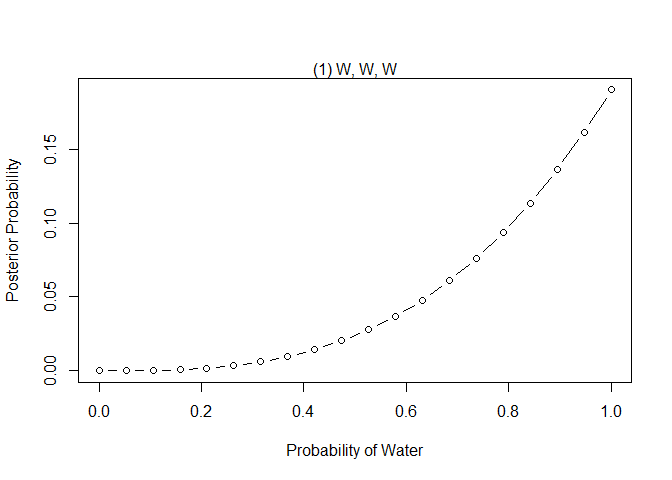
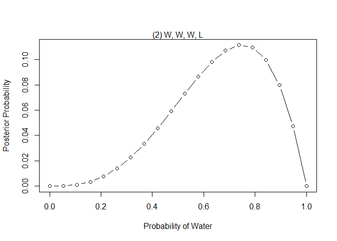
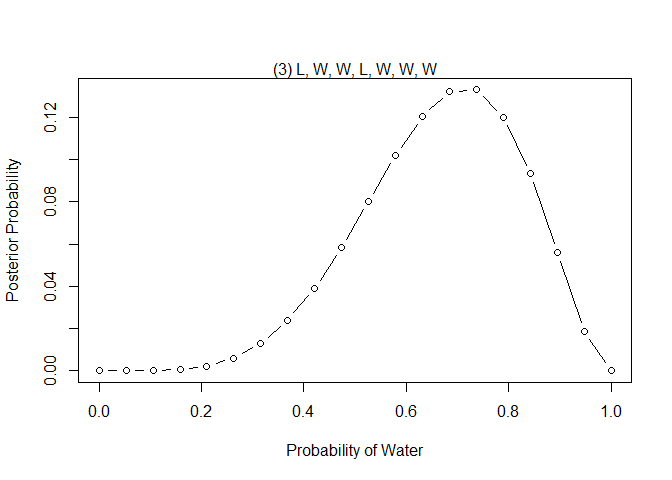
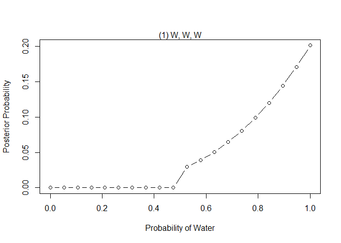
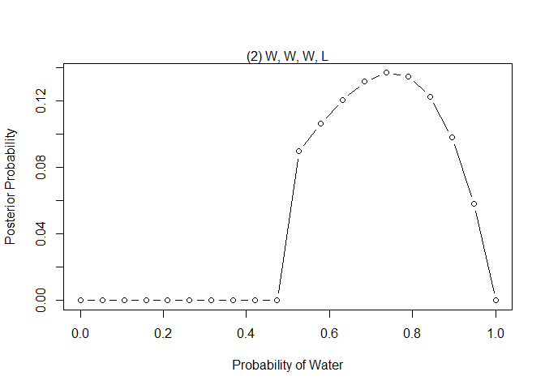
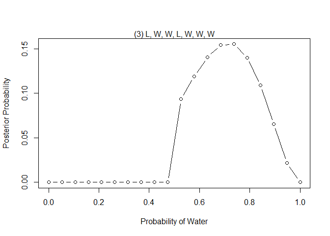

Assignment:  
2E1, 2E2, 2E3  
2M1, 2M2, 2M3, 2M4, 2M5  
  
2E1. Which of the expressions below correspond to the statement: the probability of rain on Monday?  
(1) Pr(rain)  
**(2) Pr(rain|Monday)**  
(3) Pr(Monday|rain)  
**(4) Pr(rain, Monday) = Pr(Monday)**  

4 & 2 are the same
  
2E2. Which of the following statements corresponds to the expression: Pr(Monday|rain)?  
(1) The probability of rain on Monday.  
(2) The probability of rain, given that it is Monday.  
**(3) The probability that it is Monday, given that it is raining.**  
(4) The probability that it is Monday and that it is raining.  
  
2E3. Which of the expressions below correspond to the statement: the probability that it is Monday,
given that it is raining?  
**(1) Pr(Monday|rain)**  
(2) Pr(rain|Monday)  
(3) Pr(rain|Monday) Pr(Monday)  
**(4) Pr(rain|Monday) Pr(Monday) = Pr(rain)**  
(5) Pr(Monday|rain) Pr(rain) = Pr(Monday)  

---

2M1. Recall the globe tossing model from the chapter. Compute and plot the grid approximate
posterior distribution for each of the following sets of observations. In each case, assume a uniform
prior for p.  
(1) W, W, W  
(2) W, W, W, L  
(3) L, W, W, L, W, W, W  


```r
## (1)
# define grid
p_grid <- seq( from=0 , to=1 , length.out=20 )

# define prior
prior <- rep( 1 , 20 )

# compute likelihood at each value in grid
likelihood <- dbinom( 3 , size=3 , prob=p_grid )

# compute product of likelihood and prior
unstd.posterior <- likelihood * prior

# standardize the posterior, so it sums to 1
posterior1 <- unstd.posterior / sum(unstd.posterior)

# plot
plot( p_grid , posterior1 , type="b" , xlab="Probability of Water" , ylab="Posterior Probability" ) + mtext( "(1) W, W, W" )
```

<!-- -->

```
## integer(0)
```

```r
## (2)
likelihood <- dbinom( 3 , size=4 , prob=p_grid )
unstd.posterior <- likelihood * prior
posterior2 <- unstd.posterior / sum(unstd.posterior)
plot( p_grid , posterior2 , type="b" , xlab="Probability of Water" , ylab="Posterior Probability" ) + mtext( "(2) W, W, W, L" )
```

<!-- -->

```
## integer(0)
```

```r
##(3)
likelihood <- dbinom( 5 , size=7 , prob=p_grid )
unstd.posterior <- likelihood * prior
posterior3 <- unstd.posterior / sum(unstd.posterior)
plot( p_grid , posterior3 , type="b" , xlab="Probability of Water" , ylab="Posterior Probability" ) + mtext( "(3) L, W, W, L, W, W, W" )
```

<!-- -->

```
## integer(0)
```

?
2M2. Now assume a prior for p that is equal to zero when p < 0:5 and is a positive constant when
p > 0:5. Again compute and plot the grid approximate posterior distribution for each of the sets of
observations in the problem just above.

```r
## (1)
# define grid
p_grid <- seq( from=0 , to=1 , length.out=20 )

# define prior
prior2 <- rep( 1 , 20 )
prior2 <- ifelse( p_grid < 0.5 , 0 , 1 )

# compute likelihood at each value in grid
likelihood <- dbinom( 3 , size=3 , prob=p_grid )

# compute product of likelihood and prior
unstd.posterior <- likelihood * prior2

# standardize the posterior, so it sums to 1
posterior2.1 <- unstd.posterior / sum(unstd.posterior)

# plot
plot( p_grid , posterior2.1 , type="b" , xlab="Probability of Water" , ylab="Posterior Probability" ) + mtext( "(1) W, W, W" )
```

<!-- -->

```
## integer(0)
```

```r
## (2)
likelihood <- dbinom( 3 , size=4 , prob=p_grid )
unstd.posterior <- likelihood * prior2
posterior2.2 <- unstd.posterior / sum(unstd.posterior)
plot( p_grid , posterior2.2 , type="b" , xlab="Probability of Water" , ylab="Posterior Probability" ) + mtext( "(2) W, W, W, L" )
```

<!-- -->

```
## integer(0)
```

```r
##(3)
likelihood <- dbinom( 5 , size=7 , prob=p_grid )
unstd.posterior <- likelihood * prior2
posterior2.3 <- unstd.posterior / sum(unstd.posterior)
plot( p_grid , posterior2.3 , type="b" , xlab="Probability of Water" , ylab="Posterior Probability" ) + mtext( "(3) L, W, W, L, W, W, W" )
```

<!-- -->

```
## integer(0)
```


?
2M3. Suppose there are two globes, one for Earth and one for Mars. Th e Earth globe is 70% covered
in water. Th e Mars globe is 100% land. Further suppose that one of these globes-you don't know
which-was tossed in the air and produced a "land" observation. Assume that each globe was equally
likely to be tossed. Show that the posterior probability that the globe was the Earth, conditional on
seeing "land" (Pr(Earth|land)), is 0.23.


```r
prior.twoglobes = c(0.5, 0.5)
prob.twoglobes = c(0.7, 0)
likelihood.twoglobes = dbinom( 0, 1, prob.twoglobes)
unstd.posterior.twoglobes = likelihood.twoglobes * prior.twoglobes
posterior.twoglobes = unstd.posterior.twoglobes / sum(unstd.posterior.twoglobes)
posterior.twoglobes
```

```
## [1] 0.2307692 0.7692308
```

?
2M4. Suppose you have a deck with only three cards. Each card has two sides, and each side is either
black or white. One card has two black sides. Th e second card has one black and one white side. The
third card has two white sides. Now suppose all three cards are placed in a bag and shuffl ed. Someone
reaches into the bag and pulls out a card and places it fl at on a table. A black side is shown facing up,
but you don't know the color of the side facing down. Show that the probability that the other side is
also black is 2/3. Use the counting method (Section 2 of the chapter) to approach this problem. This
means counting up the ways that each card could produce the observed data (a black side facing up
on the table).

> B/B, B/W, W/W  
> 6 sides...  
> Three ways to get black on first (2 for B/B, 1 for BW)  
> Two out of three of those ways produce B/B  

?
2M5. Now suppose there are four cards: B/B, B/W, W/W, and another B/B. Again suppose a card is
drawn from the bag and a black side appears face up. Again calculate the probability that the other
side is black.

> Five ways to get black on first...
> 4/5 of those yield B/B

